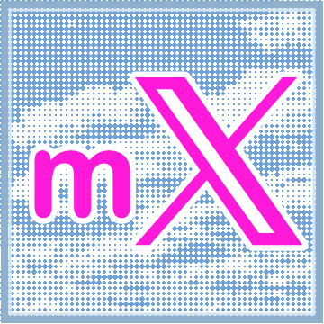
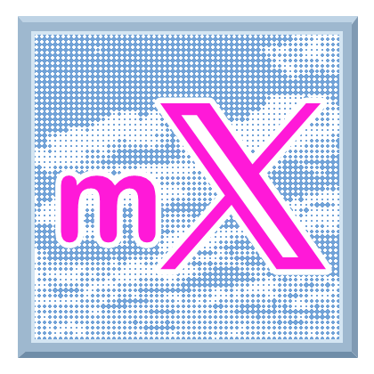

<p align="center">
  
</p>

# milXdy

milXdy is a beta Manifest V3 browser extension for X/Twitter. It combines several Remilia-oriented tools into one unpacked-extension build, one settings popup, one content bootstrap, and one local install flow.

This project is intended for GitHub beta distribution and local browser testing. It is not currently packaged through the Chrome Web Store or Firefox Add-ons.

## Features

- **Remilia Wiki**: inline Remilia Wiki concept links, hover previews, a docked Wiki side-rail app, Link Later, and Grok-assisted wiki drafting workflows.
- **Post-reading**: read-aloud controls for X/Twitter posts with optional quote, link, image alt text, OCR, and custom local TTS support.
- **Apps Hub and side rail**: shared dock for first-party app panels, app enablement, rail pinning, and first-run Lite/Balanced/Full setup.
- **RemiNet Connector**: RemiStats badges, score/beetle/poke icons, RemiliaNET pokes with sound, incoming poke indicators, optional RemiNet Chat, and tooltip/sound options.
- **Beetol Game**: Beetol hunter panel and RemiliaNET login shared with RemiNet actions.
- **Maxxer**: local avatar classification, Milady effects, tiered card themes, level badges, and legacy Miladymaxxer import.
- **Miladychan Portal**: docked Miladychan board, thread, post, and media browsing that keeps the native site as the primary posting surface.
- **Music**: docked local music library, playlists, ISRC enrichment, QR import/export, and metadata-based local radio sessions.
- **Diag**: beta diagnostics and bug-report actions for GitHub or X.

## Quick Install

For release builds:

1. Download the latest profile-specific release zip from [GitHub Releases](https://github.com/bonklek/milXdy/releases). Use `milXdy-<version>-chromium-full.zip`, `milXdy-<version>-chromium-balanced.zip`, or `milXdy-<version>-chromium-lite.zip` for Chrome, Brave, and Edge. Use the matching `firefox-full`, `firefox-balanced`, or `firefox-lite` zip for Firefox beta testing.
2. Unzip it into a permanent folder.
3. For Chrome, Brave, or Edge, open `chrome://extensions`.
4. Enable **Developer mode**.
5. Choose **Load unpacked** and select the unzipped extension folder.
6. Refresh X/Twitter tabs.

Firefox users should use a Firefox profile zip and follow the temporary add-on flow in [Install and update](docs/INSTALL_AND_UPDATE.md#firefox-beta-install) and [Firefox QA](docs/FIREFOX_QA.md).

For source builds:

```powershell
git clone https://github.com/bonklek/milXdy.git
cd milXdy
npm install
npm run build:profiles
```

Then load `dist/chromium` from `chrome://extensions`, or load `dist/firefox/manifest.json` from Firefox's temporary add-on screen. The profile build also emits Lite and Balanced outputs under `dist/chromium-lite`, `dist/chromium-balanced`, `dist/firefox-lite`, and `dist/firefox-balanced`.

Important: keep the same loaded extension folder when updating. Removing the extension or loading a different folder can reset local settings, Maxxer stats, diagnostics, and RemiNet/Beetol login state.

## Documentation

Start with the general docs, or jump directly to the guide for the app or feature you are using.

### General Docs

- [Docs index](docs/INDEX.md)
- [Install and update](docs/INSTALL_AND_UPDATE.md)
- [Full user guide](docs/USER_GUIDE.md)
- [Troubleshooting](docs/TROUBLESHOOTING.md)
- [Privacy and permissions](docs/PRIVACY_AND_PERMISSIONS.md)
- [App SDK](docs/APP_SDK.md)
- [Roadmap](docs/ROADMAP.md)
- [Contributing](docs/CONTRIBUTING.md)
- [Changelog](CHANGELOG.md)

### App And Feature Guides

| Guide | What it helps with |
| --- | --- |
|  [Apps Hub and side rail](docs/user-guides/apps-hub-and-side-rail.md) | Enable apps, pin rail icons, choose Lite/Balanced/Full setup, and manage the dock. |
|  [Root Visual Enhancements](docs/user-guides/root-visual-enhancements.md) | Appearance presets, visual polish, sounds, notifications, and performance-related visual behavior. |
|  [Tweet PNG](docs/user-guides/tweet-png.md) | Export reviewed local PNG images from X/Twitter post actions. |
|  [Remilia Wiki Hyperlinks](docs/user-guides/remilia-wiki-hyperlinks.md) | Inline wiki links, hover previews, match limits, debug mode, and link styling. |
|  [Remilia Wiki Sidebar](docs/user-guides/remilia-wiki-sidebar.md) | Docked wiki browsing, Link Later, wiki link routing, and Grok-assisted article prompts. |
|  [Post-reading](docs/user-guides/post-reading.md) | Read-aloud controls, voices, quote reading, OCR, link previews, and docked playback. |
|  [RemiStats](docs/user-guides/remistats.md) | RemiStats badges, score context, beetle icons, poke icons, tooltips, sounds, and cooldowns. |
|  [Milady Maxxer](docs/user-guides/milady-maxxer.md) | Maxxer effects, local detection, card themes, XP behavior, whitelist handles, and manual handles. |
|  [Beetol](docs/user-guides/beetol.md) | Beetol panel setup, RemiliaNET login, hunt panel styling, and shared RemiNet auth. |
|  [RemiNet Chat](docs/user-guides/reminet-chat.md) | Docked RemiliaNET chat, X Messages integration, reactions, attachments, live updates, and login checks. |
|  [Miladychan Portal](docs/user-guides/miladychan-portal.md) | Board browsing, thread reading, media previews, and native Miladychan links. |
|  [Music](docs/user-guides/music.md) | Local library indexing, playback queue, playlists, QR metadata sharing, ISRC enrichment, and radio sessions. |

## Development

```powershell
npm install
npm run typecheck
npm run build:profiles
```

Release history is in [CHANGELOG.md](CHANGELOG.md).

## Credits And Upstream Projects

milXdy integrates and adapts code, assets, behavior, or concepts from these upstream projects:

- **Miladymaxxer**: original repository `remiliacorp/miladymaxxer`.
- **RemiStats Extension**: original repository `erc1337-Coffee/remistats_extension`.

Other integrated or local feature areas include Remilia Wiki linking, Post-reading/Tweet Reader, and Beetol Game. Preserve upstream license notices when publishing release archives or source snapshots.

## License

VPL for this repository unless otherwise noted. Upstream and bundled dependencies may carry their own license terms. See [LICENSE](LICENSE).
