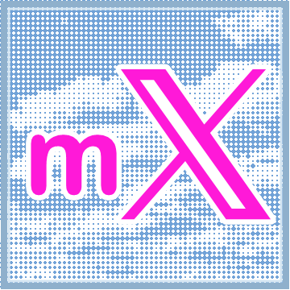
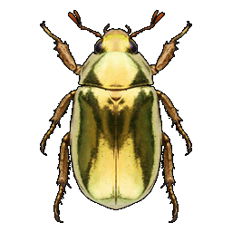

<p align="center">
  
</p>

# milXdy

milXdy is a beta Manifest V3 browser extension for X/Twitter. It combines several Remilia-oriented tools into one unpacked-extension build, one settings popup, one content bootstrap, and one local install flow.

This project is intended for GitHub beta distribution and local browser testing. It is not currently packaged through the Chrome Web Store or Firefox Add-ons.

The current release is **0.2.4 — Composer Kit**. See the [0.2.4 release notes](docs/releases/RELEASE_NOTES_0.2.4.md).

## Features

- **Remilia Wiki**: inline Remilia Wiki concept links, hover previews, a docked Wiki side-rail app, Link Later, and Grok-assisted wiki drafting workflows.
- **Post-reading**: read-aloud controls for X/Twitter posts with optional quote, link, image alt text, OCR, and custom local TTS support.
- **Apps & Features and side rail**: shared management surface for first-party app panels, feature modules, app enablement, rail pinning, and first-run Lite/Balanced/Full setup.
- **Composer Kit**: quick replies, native X Drafts routing, Remibooru reaction search and attachment, and explicit Remilia Maker/CHEESEWORLD handoffs from composer and reply controls.
- **Share Kit**: reviewed Tweet PNG previews, visual controls, copy/download/browser sharing, optional watermarking, and deliberate RemiNet Chat staging.
- **Pets Maker**: optional, disabled-by-default catalog add-on that can fetch public Maker traits by family and NFT number, then turns an explicitly selected Maker PNG and reviewed traits into a validated local pet-request ZIP.
- **RemiNet Connector**: RemiStats badges, score/beetle/poke icons, RemiliaNET pokes with sound, incoming poke indicators, optional RemiNet Chat, and tooltip/sound options.
- **Beetol Game**: Beetol hunter panel and RemiliaNET login shared with RemiNet actions.
- **Maxxer**: local avatar classification, Milady effects, tiered card themes, level badges, and legacy Miladymaxxer import.
- **Miladychan Portal**: docked Miladychan board, thread, post, and media browsing with local watched threads, explicit `milXdy`-pseudonymous text-only posting, and native-site fallback.
- **Music**: docked local music library, playlists, ISRC enrichment, QR import/export, and metadata-based local radio sessions.
- **Health**: beta diagnostics and bug-report actions for GitHub or X.

## Quick Install

Quickest Chrome install: [download `milXdy-0.2.4-chromium.zip`](https://github.com/bonklek/milXdy/releases/latest), unzip it, then load the folder from `chrome://extensions`.

Lite, Balanced, and Full are setup choices inside milXdy, not separate install decisions.

For release builds:

1. Download the latest browser-specific release zip from [GitHub Releases](https://github.com/bonklek/milXdy/releases). Use `milXdy-<version>-chromium.zip` for Chrome, Brave, and Edge, or `milXdy-<version>-firefox.zip` for Firefox beta testing.
2. Unzip it into a permanent folder.
3. For Chrome, Brave, or Edge, open `chrome://extensions`.
4. Enable **Developer mode**.
5. Choose **Load unpacked** and select the unzipped extension folder.
6. Refresh X/Twitter tabs.

Firefox or Waterfox 140 or newer users should use the Firefox zip and follow the temporary add-on flow in [Install and update](docs/getting-started/INSTALL_AND_UPDATE.md#firefox-beta-install) and [Firefox QA](docs/contributors/FIREFOX_QA.md).

For source builds:

```powershell
git clone https://github.com/bonklek/milXdy.git
cd milXdy
npm install
npm run build:profiles
```

Then load `dist/chromium` from `chrome://extensions`, or load `dist/firefox/manifest.json` from Firefox or Waterfox 140 or newer's temporary add-on screen.

Important: keep the same loaded extension folder when updating. Removing the extension or loading a different folder can reset local settings, Maxxer stats, diagnostics, and RemiNet/Beetol login state.

## Documentation

Start with the general docs, or jump directly to the guide for the app or feature you are using.

### General Docs

- [Docs index](docs/INDEX.md)
- [Install and update](docs/getting-started/INSTALL_AND_UPDATE.md)
- [Full user guide](docs/guides/README.md)
- [Troubleshooting](docs/getting-started/TROUBLESHOOTING.md)
- [Privacy and permissions](docs/getting-started/PRIVACY_AND_PERMISSIONS.md)
- [App SDK and Local Add-ons](docs/sdk/APP_SDK_OVERVIEW.md)
- [Add-on catalog submissions](docs/contributors/ADD_ON_CATALOG_SUBMISSIONS.md)
- [milXdy setup and guides](https://bonklek.github.io/milXdy/)
- [Add-ons Catalog](https://bonklek.github.io/milXdy/addons/) — Pets Maker, Composer Kit, and Share Kit inventory; Pets Maker and Share Kit are selectable, while Composer Kit remains clearly marked under review
- [App SDK](docs/sdk/APP_SDK.md)
- [Roadmap](docs/roadmap/ROADMAP.md)
- [Contributing](docs/contributors/CONTRIBUTING.md)
- [Changelog](CHANGELOG.md)

### App And Feature Guides

| Guide | What it helps with |
| --- | --- |
|  [Apps & Features and side rail](docs/guides/apps-hub-and-side-rail.md) | Enable apps/features, pin rail icons, choose Lite/Balanced/Full setup, and manage the dock. |
|  [Root Visual Enhancements](docs/guides/root-visual-enhancements.md) | Appearance presets, visual polish, sounds, notifications, and performance-related visual behavior. |
|  [Composer Kit](docs/guides/composer-kit.md) | Use quick replies, native Drafts, Remibooru reactions, and reviewed Maker handoffs. |
|  [Share Kit — Tweet PNG](docs/guides/tweet-png.md) | Review and export local PNG images or stage one deliberately in RemiNet Chat. |
|  [Pets Maker](docs/guides/custom-pet-export.md) | Install the optional add-on, declare Maker traits, and export a validated local pet-request ZIP. |
|  [Remilia Wiki Hyperlinks](docs/guides/remilia-wiki-hyperlinks.md) | Inline wiki links, hover previews, match limits, debug mode, and link styling. |
|  [Remilia Wiki Sidebar](docs/guides/remilia-wiki-sidebar.md) | Docked wiki browsing, Link Later, wiki link routing, and Grok-assisted article prompts. |
|  [Post-reading](docs/guides/post-reading.md) | Read-aloud controls, voices, quote reading, OCR, link previews, and docked playback. |
|  [RemiStats](docs/guides/remistats.md) | RemiStats badges, score context, beetle icons, poke icons, tooltips, sounds, and cooldowns. |
|  [Milady Maxxer](docs/guides/milady-maxxer.md) | Maxxer effects, local detection, card themes, XP behavior, whitelist handles, and manual handles. |
|  [Beetol](docs/guides/beetol.md) | Beetol panel setup, RemiliaNET login, hunt panel styling, and shared RemiNet auth. |
|  [RemiNet Chat](docs/guides/reminet-chat.md) | Docked RemiliaNET chat, X Messages integration, reactions, attachments, live updates, and login checks. |
|  [Miladychan Portal](docs/guides/miladychan-portal.md) | Board browsing, thread reading, local watched threads, explicit `milXdy`-pseudonymous text-only posting, media previews, and native Miladychan links. |
|  [Music](docs/guides/music.md) | Local library indexing, playback queue, playlists, QR metadata sharing, ISRC enrichment, and radio sessions. |

## Development

```powershell
npm install
npm run typecheck
npm run build:profiles
```

Release history is in [CHANGELOG.md](CHANGELOG.md).

## Credits And Upstream Projects

milXdy integrates and adapts code, assets, behavior, or concepts from these upstream projects:

- **Miladymaxxer**: original repository `remiliacorp/miladymaxxer`.
- **RemiStats Extension**: original repository `erc1337-Coffee/remistats_extension`.

Other integrated or local feature areas include Remilia Wiki linking, Post-reading/Tweet Reader, and Beetol Game. Preserve upstream license notices when publishing release archives or source snapshots.

## License

VPL for this repository unless otherwise noted. Upstream and bundled dependencies retain their own license terms. See [LICENSE](LICENSE) and [THIRD_PARTY_NOTICES.md](THIRD_PARTY_NOTICES.md).
