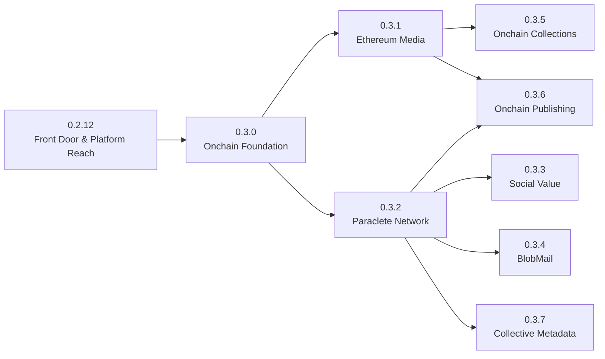

# milXdy Onchain Integration Roadmap

The `0.3.x` series is milXdy's planned Onchain Integration sequence. It progresses from shared safety and read-only verification into account abstraction, reviewed value transfer, private blob mail, collection context, advanced publishing, and collective metadata.

The weekly dates below are planning targets and move when a safety, dependency, or quality gate is not met. Every integration remains optional. Wallet-free and local-first milXdy behavior must continue to work throughout the series.

## Product sequence

| Release | Target | Name | Product outcome |
| --- | --- | --- | --- |
| `0.3.0` | 2026-10-04 | The Onchain Foundation | Shared identity, permission, RPC, wallet-action, review, and recovery boundaries. |
| `0.3.1` | 2026-10-11 | Ethereum Media | Read-only RFE playback, content-addressed sources, and collection context. |
| `0.3.2` | 2026-10-18 | The Paraclete Network | Optional browser AA gossip and narrowly scoped ERC-4337 adapters. |
| `0.3.3` | 2026-10-25 | Social Value | Reviewed `$CULT` cheers, direct tips, and receiving-address lifecycle. |
| `0.3.4` | 2026-11-01 | BlobMail | Testnet encrypted mail with key transparency and explicit delivery evidence. |
| `0.3.5` | 2026-11-08 | Onchain Collections | Optional ownership context for Remilia Gotcha, Banners, and Bonklet. |
| `0.3.6` | 2026-11-15 | Onchain Publishing | Advanced RFE publishing, portable station apps, rights research, and reviewed IPFS publication. |
| `0.3.7` | 2026-11-22 | Collective Metadata | Signed, content-addressed public observations with bounded post-Paraclete propagation and reusable consumer indexes. |

The current onboarding, screenshots, Safari, store-readiness, and mobile-research milestone moves to `0.2.12 - Front Door & Platform Reach`, so `0.3.0` can begin the onchain sequence with a clean foundation.

## Dependency map

The product rhythm is:

1. Explain and secure.
2. Read and verify.
3. Connect to decentralized transport.
4. Move small amounts of value deliberately.
5. Send encrypted messages.
6. Add collection ownership and collective-action context.
7. Publish media and operate advanced onchain applications.
8. Share bounded, provenance-aware public observations.

## Shared rules for the era

- No app receives private keys or seed phrases.
- Wallet connection, identity linkage, signatures, approvals, transfers, P2P networking, and encrypted key storage are separate capabilities.
- Enabling an app never signs, publishes, connects a wallet, or transmits value by itself.
- Every write action receives an exact, fresh review immediately before wallet handoff.
- Chain, contract, token, EntryPoint, recipient, value, calldata commitment, and maximum exposure changes invalidate prior review.
- Read-only integrations remain usable without granting signing or transaction authority.
- Unknown, stale, conflicting, reorged, unsupported, or unverifiable chain state is surfaced rather than converted into a confident default.
- Credentialed endpoints and query parameters remain session-scoped and are redacted from diagnostics and exports.
- Mainnet, privacy, permanence, settlement, availability, and ownership claims must match the evidence actually available.

## 0.3.0 - The Onchain Foundation

Goal: establish shared boundaries before any milXdy app moves value or joins a P2P network.

- [#73 - Wallet, ENS, and Gwei identity linking](https://github.com/bonklek/milXdy/issues/73)
- [#136 - Onchain app capabilities and permission disclosures](https://github.com/bonklek/milXdy/issues/136)
- [#137 - Shared chain, RPC, and wallet-action lifecycle](https://github.com/bonklek/milXdy/issues/137)
- [#138 - Transaction review, receipts, and recovery UI](https://github.com/bonklek/milXdy/issues/138)

Release boundary: no value transfer, P2P node, blob publication, or extension-managed wallet custody.

## 0.3.1 - Ethereum Media

Goal: ship useful read-only chain integrations before transaction features.

- [#139 - RFE station discovery and verified read-only playback](https://github.com/bonklek/milXdy/issues/139)
- [#140 - Content-addressed source resolution and IPFS verification](https://github.com/bonklek/milXdy/issues/140)
- [#141 - Opt-in read-only NFT collection context](https://github.com/bonklek/milXdy/issues/141)

Release boundary: listening, resolving, verifying, caching, and deep-linking only. No publishing, bidding, purchasing, approving, listing, or transferring.

## 0.3.2 - The Paraclete Network

Goal: integrate [Paraclete](https://github.com/unattended-backpack/paraclete) as optional, inspectable browser account-abstraction infrastructure.

- [#142 - Paraclete integration boundary and package provenance](https://github.com/bonklek/milXdy/issues/142)
- [#143 - Optional Paraclete AA gossip service and diagnostics](https://github.com/bonklek/milXdy/issues/143)
- [#144 - Scoped ERC-4337 UserOperation and bundler adapters](https://github.com/bonklek/milXdy/issues/144)

Release boundary: supported and reviewed UserOperations only. Gossip acceptance, bundler acceptance, inclusion, execution, and finality remain distinct states. Arbitrary app payloads are not accepted through a generic transport escape hatch.

## 0.3.3 - Social Value

Goal: make `$CULT` cheering and direct tipping the first reviewed value-transfer experience.

- [#37 - Social Value milestone epic](https://github.com/bonklek/milXdy/issues/37)
- [#145 - Receiving-address proofs and profile display](https://github.com/bonklek/milXdy/issues/145)
- [#146 - Reviewed `$CULT` cheer and direct tipping](https://github.com/bonklek/milXdy/issues/146)
- [#147 - Rotating receiving-address lifecycle](https://github.com/bonklek/milXdy/issues/147)

Release boundary: no private-key custody, automatic tip, inferred recipient, hidden approval, or claim that address rotation provides full anonymity.

## 0.3.4 - BlobMail

Goal: add a testnet/local-devnet private-mail app after the core BlobMail protocol is closed and independently reproducible.

- [#148 - BlobMail testnet inbox and reviewed composer](https://github.com/bonklek/milXdy/issues/148)
- [#149 - BlobMail identity enrollment and key transparency](https://github.com/bonklek/milXdy/issues/149)
- [#150 - BlobMail delivery evidence, storage, and recovery](https://github.com/bonklek/milXdy/issues/150)

External gate: [BlobMail V1 protocol issue #2](https://github.com/bonklek/blobmail/issues/2) must define canonical bytes, cryptographic profiles, identities, bounds, state transitions, proof levels, availability, and golden vectors. Two implementations must reproduce canonical digests before milXdy claims interoperability.

Release boundary: testnet or local devnet only; no automatic send, attachment execution, meaningful-value sponsorship, production settlement, or anonymity overclaim.

## 0.3.5 - Onchain Collections

Goal: add optional ownership context to existing Remilia experiences without converting them into trading products.

- [#151 - Wallet ownership bridge for Remilia Gotcha](https://github.com/bonklek/milXdy/issues/151)
- [#152 - Owned, seen, and tracked NFT states for Banners and daily collections](https://github.com/bonklek/milXdy/issues/152)
- [#153 - Read-only Bonklet treasury and fractional-bidding context](https://github.com/bonklek/milXdy/issues/153)

Release boundary: no paid packs, tradable local rewards, market-value dashboard, bidding, pooled contribution, vote, redemption, approval, listing, or transfer.

## 0.3.6 - Onchain Publishing

Goal: add advanced, explicitly enabled publishing after read-only media and transaction safety are stable.

- [#154 - Advanced RFE publisher app](https://github.com/bonklek/milXdy/issues/154)
- [#155 - Portable RFE station launchers and verifiable client releases](https://github.com/bonklek/milXdy/issues/155)
- [#156 - Program rights and optional encrypted-broadcast research](https://github.com/bonklek/milXdy/issues/156)
- [#157 - Reviewed IPFS publishing and pinning](https://github.com/bonklek/milXdy/issues/157)

Release boundary: advanced and disabled by default. No automatic publication, unbounded fee escalation, mutable automatic `latest` execution, private-key handling, or irreversible upload without exact artifact review.

## 0.3.7 - Collective Metadata

Goal: let one client passively observe approved public metadata and let other participating clients reuse that observation through a bounded, provenance-aware protocol built after Paraclete AA gossip.

- [#159 - Signed social-metadata observation records and commitments](https://github.com/bonklek/milXdy/issues/159)
- [#160 - Bounded social-metadata propagation over Paraclete gossip](https://github.com/bonklek/milXdy/issues/160)
- [#161 - Passive public-metadata adapters and shared local index](https://github.com/bonklek/milXdy/issues/161)
- [#132 - Shared X Account based in observations and region filtering](https://github.com/bonklek/milXdy/issues/132)

Release boundary: registered public observation types only. No arbitrary payload transport, hidden bulk crawling, private-field collection, claim that signatures prove truth, or automatic per-record L1 publication.

## Project boundaries

- [Radio Free Ethereum](https://github.com/bonklek/eth-radio) supplies the authoritative Station, viewer, publisher, verification, and playback semantics. milXdy is an optional client surface, not a competing protocol.
- [Paraclete](https://github.com/unattended-backpack/paraclete) is account-abstraction gossip infrastructure. It is not a generic message protocol, wallet, or automatic transaction executor.
- [BlobMail](https://github.com/bonklek/blobmail) is asynchronous encrypted mail over shared blob batches. It may reuse Paraclete-style collection and milXdy identity/UI infrastructure without becoming RemiNet Chat.
- [Bonklet](https://github.com/TimTinkers/Bonklet) is a separate contract system. Initial milXdy support is read-only and exact-address based.
- Remilia Gotcha remains local-first. Wallet context is optional evidence for bounded local gameplay, not proof that local cards are owned or tradable NFTs.
- Ordinary archive services remain part of the identifier-media roadmap. The `0.3.x` work owns content-addressed verification and reviewed publication.
- Collective Metadata is a bounded application protocol layered after Paraclete, not an expansion of the AA mempool into generic messaging. Signed records prove provenance and integrity, while consumer trust and conflict policies remain explicit.

## Planning ownership

- `docs/ROADMAP.md` remains the concise public release sequence.
- This document owns the cross-release onchain architecture, dependency map, release gates, and issue index.
- GitHub milestones own current scheduling and issue-level completion state.
- Detailed release implementation notes belong in `ideas/releases/` when an individual `0.3.x` cycle becomes active.
